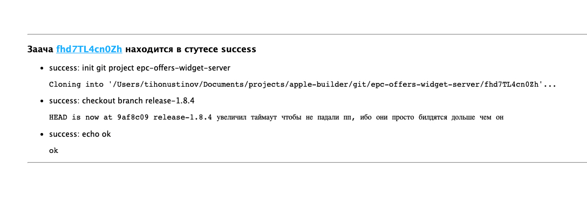

# Сервер позволяющий собирать проекты которые нужндаются в xcode




## Запуск

```bash
npm i
npm run start
```


## Зависимости 

- должен быть настроен ssh доступ к запрашиваемым git проектам
- должены быть установлены используемые утилиты, например (zip)

## Запросы

### `/tasks` Роут обрабатывающий задачи

#### `post /task/create` Создать задачу 

Для выполнения задачи на машине должен быть ssh доступ к данному проекту. 
В запросе принимается массив команд которые будут выполняться в оболочке оболочке по умолчанию системы. Текущий путь выполнения команды будет инициализированный проект. 

 - тело запроса 

```json
{
  "repository": "git@gitlab.com:project/example.git",
  "branch": "master",
  "commands": [
    "echo \"bash command this\""
  ]
}
```

 - ответ

Где `id` уникальный идентификатор задачи

```json
{
  "id": "XXXXX"
}
```


#### `get /task/{id}`  Получить статус выполнения задачи 

Аргументы: 
 - id - идентификатор задачи

Ответ: 
 - `code 201` задача в работе

```json
{
  "status": "failed/success/pending/canceled/processing",
  "repository": "git@gitlab.com:project/example.git",
  "commands": [
    {
      "command": "echo \"example\"",
      "status": "status": "failed/success/pending/canceled/processing",
      "message": "stdout"
    }
  ]
}
```

 - `code 200` задача выполнена

 ```json
{
  "status": "failed/success/pending/canceled/processing",
  "repository": "git@gitlab.com:project/example.git",
  "result": "path/to/project/files",
  "commands": [
    {
      "command": "echo \"example\"",
      "status": "failed/success/pending/canceled/processing",
      "message": "stdout"
    }
  ]
}
 ```

 - `code 400` произошла ошибка во время выполнения

```json
{
  "status": "failed",
  "repository": "git@gitlab.com:project/example.git",
  "commands": [
    {
      "command": "",
      "status": "failed/success/pending/canceled/processing",
      "message": "stdout"
    }
  ]
}
```

#### `delete /task/{id}` Завершить задачу

После завершения работы необходимо удалить задачу, чтобы можно было переиспользовать скаченный репозиторий и не качать его еще раз.

#### `put /task/{id}/cancel` Завершить задачу

Если задачу выполнять болльше не нужно необходимо отменить задачу чтобы выполнения комманд прекратилось. И после если нужно удалить.

### `/results` Роут получения результата 

#### `get /results/{project}/{id}/*` Получить файл

Ссылку на проект и id вам вырнет [метод](#get-taskid-получить-статус-выполнения-задачи) в поле `result`

 

